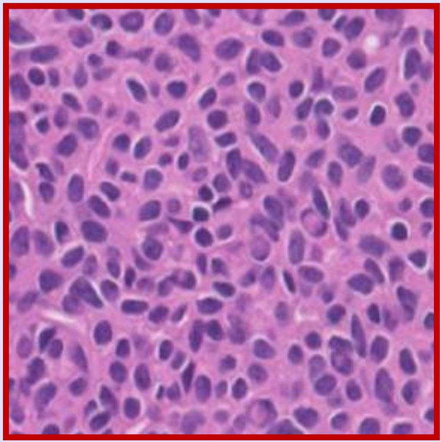
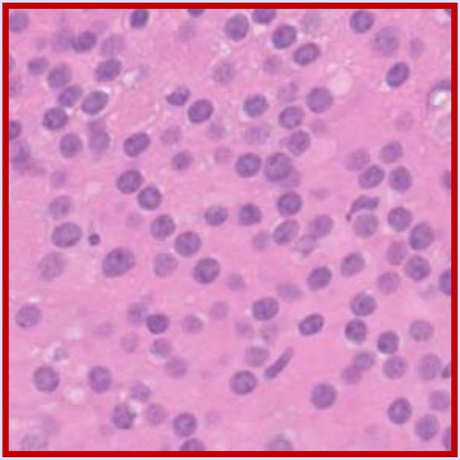

<!---
**Project Description:**

I will focus on creating neural network (NNs) that is able to accurately detect breast cancer from tissue images. There are many publicly available datasets of tissue images available online. Each pixel in the tissue image will be classified as "nucleus", "boundary", or "not nucleus and not boundary". After this classification, the neural network will then create a black and white image of only the nuclei. 

After segmenting the nuclei, features need to be computed. I envision using features like the nuclei's shape, area, and perimter. Nuclei in tissue images of an invasive breast cancer lesion will be larger and more distorted than nuclei in normal tissue images. By computing these features, the neural network will be able to predict when a tissue image is normal or when it shows the presence of a breast cancer lesion. 

Here is an example of a benign tissue image. 

Here is an example of an invasive tissue image.

The main goal of this project is to create a tool that helps doctors during their diagnoses. Doctors will be able to check their diagnoses of a patient's tissue sample. This tool will be extremely helpful in making sure that doctors do not misdiagnose a patient or even recommend treatment when no treatment is needed. 

**Project Goals:**
1. Create a neural network that segments each pixel into nucleus, boundary, or not nucleus and not boundary.
2. Compute various features.
3. Train the NN to be able to detect invasive vs. benign breast cancer lesions by looking at tissue images. 
-->

**Introduction Outline:**
**Paragraph 1: Overview of the problem** Classifying breast cancer tissue images by hand takes a lot of time and can be inaccurate.

**Paragraph 2: More Background** Cancer tissue images can look very different depending on the image, so hopefully our neural network will be able to classify these differences and identify central characteristics indicative of cancer.

**Paragraph 3: Transition paragraph/Key insights** Many previous attempts only used a few layers, so we hope to improve on their work by using more layers for our neural network.

**Paragraph 4: Details paragraph** Some of the challenges we forsee are time limitations in our algorithm, as well as difficulties in the size of the images.

**Paragraph 5: Assessment paragraph** We hope our model will be able to achieve a high degree of accuracy, comparable to a human.

**Ethical Sweep:**

General Questions:
1. Should we even be doing this?
This is valuable to do because it could advance cancer research by allow researchers to save time by automatically classifying large amounts of data. 

2. What might be the accuracy of a simple non-ML alternative?
Currently, a manual alternative is being used, which may be more accurate, but we hope that we can train our network to be as accurate as manually labeling images. Due to variations in images, it would be difficult to create a program to classify the images without using machine learning, since there are so many different cases.

3. What processes will we use to handle appeals/mistakes?
To handle appeals/mistakes, we will try to evaluate the ethical implications at all points durinng the project.We will also be open to changing our ideas/plans as issues arise. 

4. How diverse is our team?
Our team is diverse in that we all come from different backgrounds and we have people from different colleges. We also lack diversity, however, as we are all a similar age, all CS majors, and all attending similar colleges in southern california. 

Data Questions:

1. Is our data valid for its intended use?
Yes, we do plan on collecting data that is valid for our project.

2. What bias could be in our data? (All data contains bias.)
All the images could be from a certain race/gender. 
The image resolution could be different from what is used in practice.

3. How could we minimize bias in our data and model?
Being aware of possible biases and consciously collecting data from various sources could help reduce bias.

4. How should we “audit” our code and data?
For our code, we could have unit tests. For the data, we could have criteria for accepting what data to use. For example, one of our criteria is that it represents a diverse number of races, rather than just one.

Impact Questions:
1. Do we expect different errors rates for different sub-groups in the data?
We do not expect different error rates for different sub-groups in the data. We anticipate that the neural network will perform the same for all of the sub-groups. 

2. What are likely misinterpretations of the results and what can be done to prevent those misinterpretations?
It might be difficult for the general public to interpret the results. Thus, it will be important to make sure that only doctors and trained pathologists can access the results and interpret them in a correct manner. 

3. How might we impinge individuals' privacy and/or anonymity?
To protect individuals' privacy, we will make sure to anonymize all tissue images and delete all images after the completion of the project. 

**Related Works Search:**

