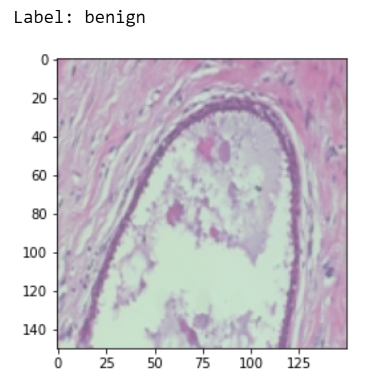
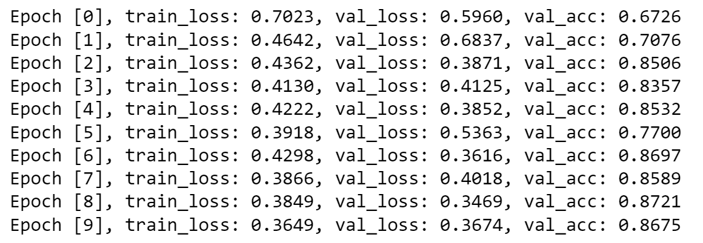
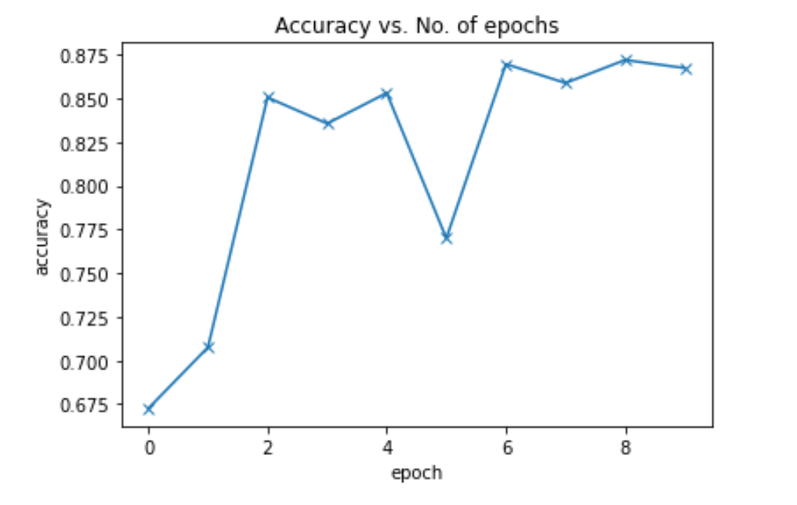
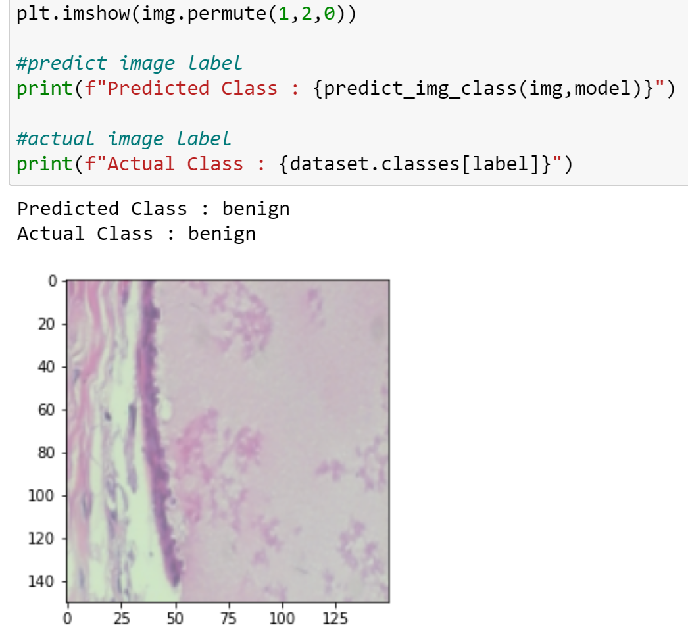

**Abstract:**

<!-- include summary of intro, methods, results, and conclusions  -->

**Introduction:**

Classifying breast cancer tissue images as cancerous or benign is an essential part of breast cancer research and diagnosis. Often, this classification is done by hand, despite the fact that classifying by hand takes a lot of time and can be inaccurate. Additionally, cancer tissue images can look very different depending on the image, furthur complicating classification efforts. These factor led us to try and develop a neural network to classify breast cancer tissue images as benign or malignant, with the hope of achieving similar accuracy to human classification. One [study](https://www.thelancet.com/journals/landig/article/PIIS2589-7500(20)30003-0/fulltext) evaluated the accuracy of 12 radiologists in diagnosing breast cancer and found that they had an accuracy of around 77%. 

There are many existing approaches to this problem, which we hope to build off of. A [paper](https://journals.plos.org/plosone/article?id=10.1371/journal.pone.0177544) titled *Classification of breast cancer histology images using Convolutional Neural Networks* uses a convolutional neural network to classify breast cancer. This paper uses breast biopsy images. They extracted features, mostly features about a single nucleus like its color, shape, and density. They performed binary classification (carcinoma and non-carcinoma) which had an accuracy of 83.3%, and additionally they classified in four classes (normal tissue, benign lesion, in situ carcinoma and invasive carcinoma) which had an accuracy of 77.8%. 

A [paper](https://academic.oup.com/jnci/article/111/9/916/5307077?login=true) titled *Stand-Alone Artificial Intelligence for Breast Cancer Detection in Mammography: Comparison With 101 Radiologists* compared the performance of radiologists to that of an AI system in detecting breast cancer. The AI system used deep learning convolutional networks, feature classifiers, and image analysis algorithms to detect calcification and soft tissue lesions. Based on the presence of these features, the likelihood of cancer was determined. They found that the AI system performed about as well as the radiologists, although they did mention that such a system requires further investigation.

Neural networks are also used in many other pathology images. A [paper](https://pubmed.ncbi.nlm.nih.gov/27563488/) titled *UDeep learning for digital pathology image analysis: A comprehensive tutorial with selected use cases* explores different cases where neural networks have been used to classify pathology images. They used an open source framework (Caffe) with a singular network architecture, and where able to achieve high accuracy. In their lymphoma classification network, for example, they had a classification accuracy of 0.97 across 374 images. 

Our network will differ from these previous approaches in a variety of ways. Unlike these papers, our network will classify the images directly instead of extracting features from the images which it uses to classify. Like these papers, we will use a convolutional neural network to perform the classification.

Some of the challenges we forsee are time limitations in our algorithm, as well as difficulties in the size of the images. We do not expect different error rates for different sub-groups in the data. We anticipate that the neural network will perform the same for all of the sub-groups. We hope our model will be able to achieve a high degree of accuracy, comparable to a human. It might be difficult for the general public to interpret the results. Thus, it will be important to make sure that only doctors and trained pathologists can access the results and interpret them in a correct manner. To protect individuals' privacy, we will make sure to anonymize all tissue images and delete all images after the completion of the project. 

**Ethics:**

Almost all AI applications raise some ethical issues, but using AI in a health setting raises additional issues. In 2021, the World Health Organization released a [Document](https://www.who.int/publications/i/item/9789240029200) outlining six guidlines for AI in health applications. The six guidlines are: 
- protecting autonomy: In this project, tissue images from patients are used, and so it is important that their health data is protected by anonymizing the data and ensuring that personal data is not linked to any of the images. Additionally, if we deploy this model on the web, it is important that any images people upload are similarly protected. Additionally, if this model is used as a diagnostic tool in a healthcare setting, it is important that patients conset to this use of AI. 
- promoting human safety and well-being: This is particularly important in this model, as a false negative predicion will be much more detremental than a false positive prediction. Thus, it is important that our model minimizes the number of false negatives overall, and we will hold this as a priority when developing and evaluating the model. 
- ensuring transparency: If this model is used to make healthcare decisions, it is important that it is publically available. Additionally, it is essential that the process and datasets used to train it are made clear, since this model could be used to help make very important decisions and diagnoses. 
- fostering accountability: When harms do occur as the result of this model, such as a false negative, there need to be methods in place to address the harms and provide some sort of accountability. With AI in particular, it is often difficult to know who to hold accountable (the doctors using the AI, the developers of the AI, etc.), so if this ever gets deployed in a clinical setting, it is essential to have processes in place for addressing harms if they occur. 
- ensuring equity: This is particularly important as some other health algorithms have been found to have racial bias built in, such as an [algorithm](https://www.theverge.com/2019/10/24/20929337/care-algorithm-study-race-bias-health) used by large healthcare and insurance companies that flags patients that may need more care resources, and largely under-identifies black patients. In this model, this bias will likely appear in the dataset we used. Unfortunately, we were unable to find demographic information for the tissue samples used, so we were unable to control for any racial bias present in the dataset. Additionally, if all the images are from the US, that could cause biases and lead the model to be ineffective in other countries. If we were to deploy our model, it would be essential to train using a dataset that we know is diverse. 
- promoting tools that are responsive and sustainable: If our model is used in a healthcare of research setting, it is important to continue evaluating our model and making any changes or updates that are needed. 

**Methods:**

For our software, we plan on using [PyTorch](https://pytorch.org/). PyTorch is an open source machine learning library and we will easily be able to learn how to use PyTorch. In particular, we will get a lot of our code from this [tutorial initially](https://pytorch.org/tutorials/beginner/blitz/cifar10_tutorial.html) and then modify it to achieve the best results. 

We plan on using [this dataset](https://web.inf.ufpr.br/vri/databases/breast-cancer-histopathological-database-breakhis/), which we found from one of our [related works](https://www.inf.ufpr.br/lesoliveira/download/TBME-00608-2015-R2-preprint.pdf). This dataset has 8,000 images, of which 2,500 are benign and 5,500 are malignant. All of these images have dimensions of 700 x 460 pixels. Each image is a 3 channel RGB picture in PNG format. 

Here is an example of a sample benign image in the dataset:

Once we have downloaded our dataset, we will use PyTorch's [ImageFolder](https://pytorch.org/vision/main/generated/torchvision.datasets.ImageFolder.html) class which prepares a dataset that is structured in folders. In order to use this class, we had to write a separate Python script that splits all our data into a test and a train folder. We have two classes in our dataset - benign and malignant.

Next, we use PyTorch's random_split() function, as well as the [DataLoader](https://pytorch.org/docs/stable/data.html#torch.utils.data.DataLoader) class. This enables us to randomly split the dataset into a training set and a validation set.

Then, we define a convolutional neural network using PyTorch's built in model that takes 3 channel images (3 initial inputs). Our neural network has 3 CNN blocks, where each block contains two convolution layers and one max-pooling layer. After applying the convolution, we use a flatten layer to convert the tensor from 3D to one-dimensional. 

Lastly, we will train the network and test the model using the validation set. 

<!--
**Discussion:**

*Expected Results*

We expect our results to be similar to those of the related papers we read. In particular, we will measure the AUC, which represents the area underneath the ROC curve. An ROC curve (receiver operating characteristic curve) is a graph showing the performance of a classification model at all classification thresholds. It usually plots two parameters - the false positive and true positive rate. If our classification model has a high accuracy, the ROC curve will have a larger area underneath the curve (AUC). The following picture contrasts a few ROC curves.

We see that as the model improves, the area underneath the curve increases as well until we reach a perfect classifier that has an AUC of 1. 

The AUC provides an aggregate measure of performance across all possible classification thresholds. AUC represents the probability that a random positive example is positioned to the right of a random negative example. A model that has a 100% accuracy rate will have an AUC of 1 and similarly, a model that has a 0% accuracy rate will have an AUC of 0. We expect our AUC to be around 0.8, which is close to the AUC value of the other related papers. 

We will also measure the precision, recall, sensitivity, and accuracy of our model. Ideally, we will have high precision and accuracy, as this will signify that our model is able to predict the class type of any breast cancer tissue sample. 

*Interpretation and Evaluation of our Results:*

To evaluate our results, we can use a confusion matrix. This will tell us the accuracy, false positive rate, false negative rate, and recall. We can use these metrics to compare results with the other papers we looked at during the literature search. Using this comparison, we can then try to hypothesize about reasons for the difference, such as whether the size of the network was the dominant factor, whether it was the optimizer that was being used, or if there were other reasons for the difference. 

Additionally, we will aim to also split up the results by different factors if possible (such as age/race), and see if the results vary significantly between categories. This could tell us if, for example, our neural network was being trained to learn features relating to one age/race more than another.
-->

**Results:**

Our model is a convolutional neural network using PyTorch's built in model that takes 3 channel images (3 initial inputs). Our neural network has 3 CNN blocks, where each block contains two convolution layers and one max-pooling layer. After applying the convolution, we use a flatten layer to convert the tensor from 3D to one-dimensional. We used a learning rate of 0.001 and the Adam optimizer as our hyperparameters. Our batch size is 128, and from the results of the random_split(), the length of the training dataset is 5909 samples and the length of the validation dataset is 2000 samples. 

The following shows the results of testing our model by running it for ten epochs on the validation dataset.  

Our model's highest accuracy was 0.8721, during epoch 8. We also see that the loss on the training dataset decreased over time, going from 0.7 to 0.3. 

The following graph plots the accuracy vs. number of epochs. We see that the accuracy increases as more epochs run, until the accuracy eventually settles around 0.86 by the end. 

The related paper that used the dataset we did achieved an accuracy range of 80 - 85%. Since our accuracy was around 87%, we think we did a good job replicating the paper's results. There is definitely room for improvement, however, as most models today have an accuracy of over 90%. 

We can compare our model's predicted class of an image with the actual class as well, as another way of testing the strength of our model. The following picture shows an example image, with the predicted class of benign given by the model, followed by the image's actual class of benign. 

**Reflection/Future Work:**

The neural network did a good job of classifying the images provided - with a maximum accuracy of 87.2%. While this is a reasonably high accuracy, it is slightly lower than the accuracy obtained by the models in [this](https://ieeexplore.ieee.org/stamp/stamp.jsp?tp=&arnumber=7312934) paper that uses the same dataset. Since the paper uses different algorithms such as One Nearest Neighbour and a Random Forests, it would be interesting to experiment with the architecture of the neural network we implemented and see if we can implement a neural network that reaches (and outperforms) the accuracy of these other algorithms. 

Also, the dataset contained images of multiple magnification levels, and the paper referenced above trained and tested their algorithms individually for each magnification level. For simplicity, we decided to combine all the different magnification levels rather than train and test based on the magnification levels. In the future, separating the training and testing data based on the magnification level and training our neural network on each magnification level individually might lead to higher accuracy. 

Additionally, in one of the early preprocessing steps, we resize each of the images in the dataset to a fixed size of 150 pixels by 150 pixels. This possibly leads to a loss of information. Hence, it would be informative to omit this resizing step (or reshape the images to a different size) and observe how this affects the performance of the model.

Furthermore, our model uses the Adam optimizer. We leave it to future work to experiment with different optimizers and perform hyperparameter tuning to see how this impacts the accuracy obtained by the model. Additionally, we only ran our model for ten epochs (and did not observe much overfitting). It would be valuable to run our model for an order of magnitude higher number of epochs and see whether this leads to a higher accuracy or if it leads to overfitting of the data.

